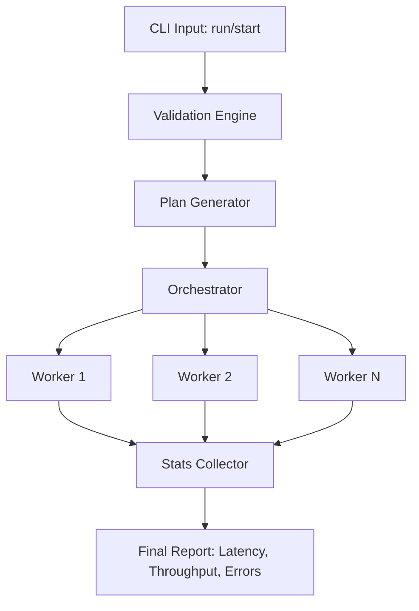

# Code Architecture: httpcl

## 1. Internal Design Flow



## 2. Project Structure

```
httpcl/
├── cmd/
│   └── httpcl/
│       └── main.go         # Entry point: parses flags and initializes the app
├── internal/
│   ├── ui/
│   │   ├── interactive.go  # 'start' command wizard logic
│   │   └── renderer.go     # ASCII TUI and real-time progress rendering
│   ├── engine/
│   │   ├── worker.go       # Core logic for requests and pipelining
│   │   ├── orchestrator.go # Worker pool management and CPU core checks
│   │   └── client.go       # HTTP client and transport configuration
│   └── stats/
│       └── collector.go    # Thread-safe metrics (Latency, RPS, Error rates)
├── pkg/
│   └── netutil/            # Reusable helpers for DNS and OS limit checks
├── go.mod
└── Makefile                # Build, test, and install shortcuts
```

## 3. Directory Responsibilities

- `cmd/httpcl/`: Thin wrapper around the Cobra CLI. It validates inputs and hands off execution to the `internal/engine`.

- `internal/engine/`: The heart of the tool.
  - `orchestrator.go` compares requested workers against runtime.NumCPU().
  - `worker.go` implements the "spammer" logic using channels to signal completion.

- `internal/ui/`: Implements the "no-emoji" constraint using ANSI escape codes and ASCII borders.

- `internal/stats/`: Uses atomic counters or mutexes to ensure high-speed workers don't cause race conditions during metric updates.

## 4. Execution Logic & Data Flow

1. **Initialization**: `main.go` parses flags. If `start` is called, `ui/interactive.go` populates the configuration.

2. **Orchestration**: `engine/Orchestrator` verifies system resources (`ulimit` and CPU cores) and initializes the `stats/Collector`.

3. **Execution**: The Orchestrator launches `W` goroutines. Each worker maintains persistent connections and sends requests based on the pipeline factor (`P`).

4. **Reporting**: Workers send results via a shared channel to the Collector. The `ui/Renderer` periodically polls the Collector to refresh the TUI until the duration (D) expires or a signal is received.
