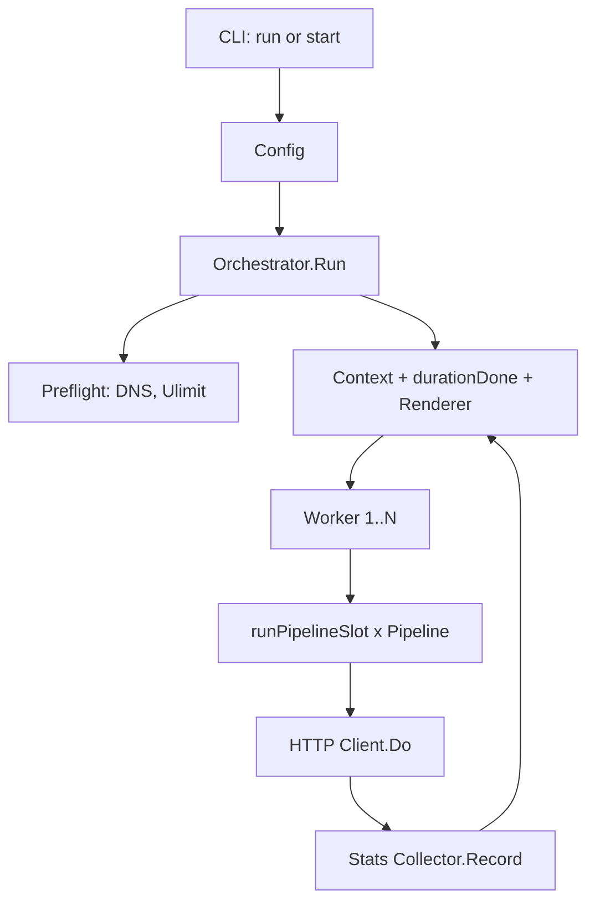

# Code Architecture: httpcl

## 1. Internal Design Flow

### High-level diagram



### Flow in depth

This section describes exactly how control and data move through the program: from CLI entry to the last request finishing and the final report being printed.

---

#### 1.1 Entry and CLI dispatch

- **`cmd/httpcl/main.go`** calls `cli.Execute()`. No benchmark logic lives here.
- **`internal/cli/root.go`** registers two Cobra commands:
  - **`start`**: runs `ui.RunInteractiveWizard()`, maps the returned `WizardConfig` into `engine.Config`, then calls `runBenchmark(cfg)`.
  - **`run`**: validates that `-u/--url` is set, builds `engine.Config` from flags (including optional `-b/--body` as `[]byte`), then calls `runBenchmark(cfg)`.
- **`runBenchmark(cfg)`** (in `root.go`) creates a `ui.Renderer` via `ui.NewRenderer()`, creates an `engine.Orchestrator` via `engine.NewOrchestrator(cfg, renderer)`, and calls `orch.Run()`. All benchmark execution is inside `Orchestrator.Run()`.

So: **CLI only parses input and builds `engine.Config`; the single entry into the engine is `Orchestrator.Run()`.**

---

#### 1.2 Orchestrator.Run() — setup and preflight

When `orch.Run()` is invoked:

1. **URL validation**  
   If `o.cfg.URL` is empty, `Run()` returns an error immediately. No workers or HTTP client are created.

2. **DNS preflight**  
   `netutil.PreflightDNS(o.cfg.URL)` is called:
   - **What it does:** `url.Parse` to validate the URL; extracts hostname; calls `net.LookupHost(host)` to resolve the host. If parsing or resolution fails, it returns an error and `Run()` returns that error (benchmark does not start).
   - **Why:** Fail fast before opening many connections; avoids misleading "connection refused" or timeouts when the hostname is wrong or unresolvable.

3. **Ulimit check**  
   `netutil.CheckUlimitWarning(o.cfg.Connections)` is called:
   - **What it does:** On Unix, calls `syscall.Getrlimit(syscall.RLIMIT_NOFILE, &rLimit)`. If the requested connection count exceeds the soft limit (`rLimit.Cur`), it returns a non-nil error. On failure of `Getrlimit` or on non-Unix, it returns `nil` (best-effort only).
   - **How it’s used:** If an error is returned, it is printed to stderr as a warning and `ui.PrintStepResult("Ulimit", "warning", false)` is called. Execution continues; the benchmark is not aborted.

4. **Run header**  
   `ui.PrintRunHeader(url, workers, connections, pipeline, duration)` prints the target and parameters so the user sees what is being run.

5. **Context and duration signal**  
   - **`ctx, cancel := context.WithCancel(context.Background())`**  
     This context is **not** created with a timeout. It is cancelled only when the user hits Ctrl+C (or when the benchmark finishes and the orchestrator calls `cancel()` so the renderer can exit). So **in-flight HTTP requests are never aborted by the duration timer**; only SIGINT/SIGTERM aborts them.
   - **`durationDone := make(chan struct{})`**  
     A channel used as a “duration expired” signal.  
     **`time.AfterFunc(o.cfg.Duration, func() { close(durationDone) })`** schedules a one-shot: after `o.cfg.Duration` (e.g. 2s), `durationDone` is closed. Workers use this to **stop starting new requests** while still **allowing requests already sent to complete**.

6. **Signal handling**  
   `sigCh := make(chan os.Signal, 1)` and `signal.Notify(sigCh, syscall.SIGINT, syscall.SIGTERM)`. A separate goroutine (see below) selects on `sigCh` and, when a signal is received, calls `cancel()` so workers and the renderer see `ctx.Done()` and exit.

7. **Collector and HTTP client**  
   - **`collector := stats.NewCollector()`**  
     Creates the single shared stats collector (start time set to now; atomics and mutex-protected latency/RPS/bucket state).
   - **`client := newHTTPClient(o.cfg.Connections)`**  
     Builds one `*http.Client` with a custom `http.Transport`: `MaxIdleConns` and `MaxIdleConnsPerHost` set to `o.cfg.Connections`, keep-alive and HTTP/2 enabled, no `Client.Timeout` (timeouts are controlled by context and duration logic). All workers share this client.

---

#### 1.3 Renderer goroutine

A goroutine is started that:

- Runs a **200 ms ticker**.
- In a loop, **select**:
  - **`<-ticker.C`**: take a `collector.Snapshot()` and call `o.renderer.Render(snap)` to refresh the live TUI line.
  - **`<-ctx.Done()`**: take a final `collector.Snapshot()`, call `o.renderer.RenderFinal(snap)`, close the `doneRendering` channel, and return.

So: **live updates use `Render(snap)`; the final report is rendered once when `ctx` is cancelled, via `RenderFinal(snap)`.** The orchestrator later waits on `<-doneRendering` so it does not return before the final report is printed.

---

#### 1.4 Worker spawn and their arguments

- **`reqsPerWorker := o.cfg.Connections / o.cfg.Workers`** (minimum 1). This value is passed as the `connections` argument to each worker; the current worker implementation does not use it for connection limiting (the single shared client already has a connection pool).
- **For `i := 0; i < o.cfg.Workers; i++`** the orchestrator starts one goroutine per worker, each running:
  - **`worker(ctx, durationDone, client, o.cfg, reqsPerWorker, collector)`**

So every worker receives:
- **`ctx`**: cancelled on SIGINT/SIGTERM or after all workers have returned and the orchestrator calls `cancel()`.
- **`durationDone`**: closed after `o.cfg.Duration`; workers must stop starting new requests when this is closed but may finish the request they are already in.
- **`client`**: the shared HTTP client.
- **`o.cfg`**: method, URL, body, duration, workers, pipeline, etc.
- **`reqsPerWorker`**: currently unused in worker logic.
- **`collector`**: the shared stats collector.

---

#### 1.5 Signal watcher and shutdown sequence

- A goroutine **select**s on **`sigCh`** and **`ctx.Done()`**. When the user presses Ctrl+C, `sigCh` receives and the goroutine calls **`cancel()`**. When `ctx` is already done (e.g. after normal finish), the goroutine just exits.
- **`wg.Wait()`** blocks until every worker goroutine has returned. Workers return when they see `ctx.Done()` (user interrupt) or when they see `durationDone` closed and have finished their current request (see below).
- After **`wg.Wait()`** returns, the orchestrator calls **`cancel()`** so the renderer’s select sees `ctx.Done()`, runs **`RenderFinal(snap)`**, and closes **`doneRendering`**.
- **`<-doneRendering`** ensures `Run()` does not return until the final report has been rendered.

So the order is: **workers drain (no new requests after duration, in-flight complete) → wg.Wait() → cancel() → renderer does RenderFinal and closes doneRendering → Run() returns.**

---

#### 1.6 Worker and runPipelineSlot — how requests are issued and when they stop

- **`worker(ctx, durationDone, client, cfg, connections, collector)`**:
  - **Pipeline count:** `pipeline := cfg.Pipeline` (minimum 1).
  - It starts **`pipeline`** goroutines, each running **`runPipelineSlot(ctx, durationDone, client, cfg, collector)`**.
  - It then **`wg.Wait()`** on those goroutines. So each “worker” is one logical unit that runs `pipeline` concurrent request loops sharing the same client and collector.

- **`runPipelineSlot(ctx, durationDone, client, cfg, collector)`**:
  - Builds the initial **`*http.Request`** with **`http.NewRequestWithContext(ctx, cfg.Method, cfg.URL, bodyReader)`**. If `cfg.Body` is set, the body is `bytes.NewReader(cfg.Body)` and `ContentLength` is set. This request is reused only for the no-body case; with a body, each iteration builds a new request (see below).
  - **Loop:**
    1. **Select** on **`ctx.Done()`, `durationDone`, and `default`**:
       - **`<-ctx.Done()`**: return immediately (user interrupt or shutdown). No further requests.
       - **`<-durationDone`**: return immediately. Duration has ended; this slot stops starting new requests. Any request already in flight is still in `client.Do()` and will complete before the next iteration.
       - **`default`**: fall through and send one more request.
    2. **Request build:** If there is a body, create a **new** request with `NewRequestWithContext(ctx, ...)` and a fresh `bytes.NewReader(cfg.Body)` (readers are consumed). Otherwise reuse the existing `req`.
    3. **`bytesSent := len(cfg.Body)`** (0 for GET, etc.).
    4. **`start := time.Now(); resp, err := client.Do(r); latency := time.Since(start)`.** The HTTP call is bound to `ctx`: if `ctx` is cancelled (e.g. SIGINT), `Do` can abort; **`durationDone` does not cancel `ctx`**, so when the duration ends only the *next* iteration sees `durationDone` closed and returns—the current `Do()` runs to completion.
    5. Read and discard the response body with `io.Copy(io.Discard, resp.Body)`, count **`bytesRecv`**, close the body.
    6. **Success:** `err == nil && resp != nil && resp.StatusCode >= 200 && resp.StatusCode < 500`.
    7. **`collector.Record(latency, success, bytesSent, bytesRecv)`** to update totals, success/error counts, latency samples, and (inside `Snapshot`) per-second buckets for RPS and bytes/sec.
    8. Loop back to the **select** (step 1).

So: **the request path is “select → build request (if needed) → client.Do(r) → read body → Record → loop”.** Context is used only for cancellation (SIGINT); the duration is enforced by **not starting new work** after `durationDone` is closed, while the current `Do()` and body read always complete. That is why you do not see a burst of errors at the end of the duration: requests that started before the timer expired are allowed to finish.

---

#### 1.7 Stats collector — Record and Snapshot

- **`Record(latency, success, bytesSent, bytesRecv)`**:
  - Atomically increments total requests, total bytes sent, total bytes received, and either successes or errors.
  - Under a mutex, appends `latency` to a slice (up to a cap) for percentile computation. Per-second buckets for RPS and bytes/sec are **not** updated in `Record`; they are updated inside **`Snapshot()`** when a full second has elapsed (see below).

- **`Snapshot()`**:
  - Computes elapsed time since the collector was created.
  - Loads atomics for total requests, bytes sent, bytes received, successes.
  - Under the mutex: if at least one second has passed since the last bucket, it pushes a new RPS and bytes/sec bucket (request delta and byte delta over that second), then updates last bucket time and counts. It then copies the latency slice and bucket slices so callers get a consistent view.
  - Builds a **`Snapshot`** struct: totals, duration, average RPS and bytes/sec over the whole run, latency percentiles (P25, P50, P97.5, P99, avg, stdev, max) from the sorted latency samples, and RPS/Bytes-per-sec percentiles and stdev/min from the per-second buckets.
  - **No global lock is held during percentile sorting;** sorting is done on the copied slices after the mutex is released, so `Snapshot()` remains safe for concurrent callers (renderer ticker and final render).

---

#### 1.8 Summary: request path and context handling

- **Request path:** CLI → Config → `Orchestrator.Run()` → preflight (DNS, ulimit) → create `ctx`, `durationDone`, client, collector, renderer goroutine → spawn workers → each worker spawns `pipeline` × `runPipelineSlot` → each slot loops: select (ctx/durationDone/default) → build request → `client.Do(req)` → read body → `collector.Record(...)`.
- **Context:** One cancel-only `ctx`; cancelled on SIGINT/SIGTERM or after `wg.Wait()`. Used in `NewRequestWithContext` and thus in `client.Do()`; when it is cancelled, in-flight requests can fail (e.g. context canceled).
- **Duration:** Implemented by closing `durationDone` after `o.cfg.Duration`. Workers check it at the **start** of each loop iteration; they do not cancel `ctx`. So when the duration ends, no new requests are started, but every request already in `client.Do()` or in the body read completes and is recorded. Then workers return, `wg.Wait()` unblocks, `cancel()` runs, and the renderer prints the final report.

---

## 2. Project Structure

```
httpcl/
├── cmd/
│   └── httpcl/
│       └── main.go         # Entry point: delegates to cli.Execute()
├── internal/
│   ├── cli/
│   │   └── root.go         # Cobra commands (start, run), flags, runBenchmark wiring
│   ├── ui/
│   │   ├── banner.go       # Intro ASCII banner
│   │   ├── interactive.go  # 'start' command: bufio-based wizard → WizardConfig
│   │   ├── renderer.go     # ASCII TUI: Render (live), RenderFinal (report)
│   │   └── run_header.go  # PrintStepResult, PrintRunHeader
│   ├── engine/
│   │   ├── config.go       # Config struct (Method, URL, Body, Connections, Duration, Workers, Pipeline)
│   │   ├── client.go       # newHTTPClient(maxConns): Transport, keep-alive, no Client.Timeout
│   │   ├── orchestrator.go # Run(): preflight, ctx/durationDone, workers, renderer, shutdown
│   │   └── worker.go       # worker() + runPipelineSlot(): pipeline slots, duration drain
│   └── stats/
│       └── collector.go    # Record(), Snapshot(); atomics + mutex; latency/RPS/bytes percentiles
├── pkg/
│   └── netutil/
│       └── checks.go       # PreflightDNS, CheckUlimitWarning
├── go.mod
└── Makefile
```

## 3. Directory Responsibilities

- **`cmd/httpcl/`**  
  Thin entry point; no benchmark logic.

- **`internal/cli/`**  
  Cobra root, `start` and `run` commands, flag definitions. Builds `engine.Config` from wizard output or flags. Single call into engine: `runBenchmark(cfg)` → `NewOrchestrator(cfg, renderer).Run()`.

- **`internal/engine/`**  
  Core benchmark logic. **`config.go`**: benchmark parameters. **`client.go`**: one shared HTTP client and transport. **`orchestrator.go`**: URL check, DNS and ulimit preflight, context and duration channel setup, signal handling, collector and client creation, renderer goroutine, worker spawn, `wg.Wait()` and shutdown. **`worker.go`**: one worker = multiple pipeline slots; each slot runs a request loop that respects `ctx` (cancel) and `durationDone` (stop starting new work after duration).

- **`internal/ui/`**  
  No emojis; ASCII and box-drawing; ANSI colors. **`banner.go`**: intro banner. **`interactive.go`**: wizard prompts, `WizardConfig`. **`renderer.go`**: live line (`Render`) and final report grid/summary (`RenderFinal`). **`run_header.go`**: step results and run header.

- **`internal/stats/`**  
  Thread-safe aggregation: atomics for totals and success/error; mutex for latency samples and per-second bucket state. `Snapshot()` computes percentiles and flushes 1s buckets.

- **`pkg/netutil/`**  
  Reusable: URL parsing + DNS lookup; Unix `RLIMIT_NOFILE` check vs requested connections.

## 4. Execution Logic & Data Flow (summary)

1. **Initialization:** `main` → `cli.Execute()`. For `start`, the wizard fills a config; for `run`, flags fill it. `runBenchmark(cfg)` creates renderer and orchestrator.
2. **Orchestration:** `Orchestrator.Run()` validates URL, runs DNS preflight (abort on failure), ulimit warning (continue on failure), prints run header, creates cancel-only context and duration channel, shared collector and HTTP client, and starts the renderer goroutine.
3. **Execution:** `Run()` starts `Workers` goroutines, each running `worker(ctx, durationDone, client, cfg, …)`. Each worker runs `Pipeline` concurrent `runPipelineSlot` loops. Each slot loops: check ctx/durationDone → build request → `client.Do()` → read body → `collector.Record()`. When `durationDone` is closed, slots stop after the current request; when `ctx` is cancelled, they exit immediately.
4. **Reporting:** The renderer goroutine ticks every 200 ms and calls `Render(snap)`; when `ctx` is cancelled (after workers have drained), it calls `RenderFinal(snap)` and signals done. `Run()` waits on that before returning.
